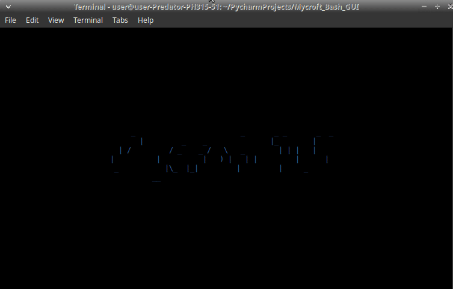

# Mycroft TUI

Text-based User Interface for [Mycroft-core](https://github.com/MycroftAI/mycroft-core/)

```bash
python -m jarbas_mycroft_tui
```

press X to exit





GUI debugger 

```bash
python -m jarbas_mycroft_tui.gui_debugger
```


